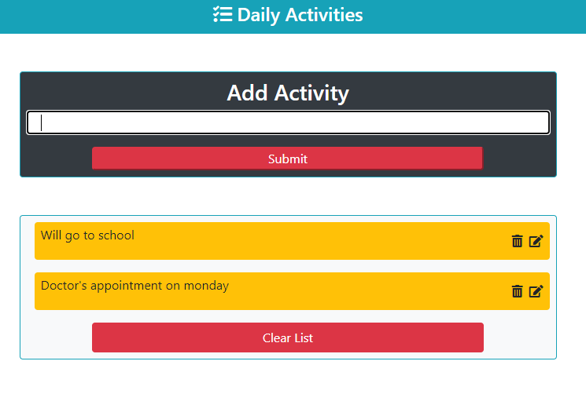

# Daily_activities_react

> This is a simple to-do list build with react. The main aim of this project was to recreate a simple but effective editable to-do list. This app has functionalities like : adding activities, deleting activities, editing activities.



## Live Demo

[Daily_activities_react](https://daily-activities-react.netlify.app/)

## Built With

- Html
- Css
- Vanila Js
- Atom text editor
- React Js
- Npm

# Getting Started

To get a local copy of the repository please run the following commands on your terminal:

```
$ cd <folder>
```

```bash

$ git clone `https://github.com/ajkacca457/daily-activities-react.git`
$ cd daily-activities-react
$ Run `npm install` to install the necessary modules

```

# Authors

👤 **Avijit Karmaker**

- Github: [@Avijit](https://github.com/ajkacca457)
- Linkedin: [@Avijit](https://www.linkedin.com/in/avijit-karmaker-8738a54)

## 🤝 Contributing

Contributions, issues and feature requests are welcome!

## Show your support

Give a ⭐️ if you like this project!

## Copyright
This is a project developed by Avijit.
